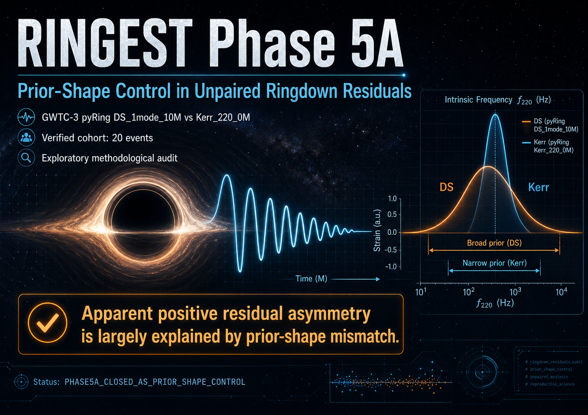

# RINGEST Phase 5A

Reproducible methodological audit of an apparent positive frequency-residual asymmetry in GWTC-3 ringdown data.

## Status

`PHASE5A_CLOSED_AS_PRIOR_SHAPE_CONTROL`

## Summary

Phase 5A audits an unpaired posterior-level comparison between:

- `pyRing DS_1mode_10M`, using the free frequency `f_t_0`
- `pyRing Kerr_220_0M`, using remnant samples `Mf` and `final_spin`

The residual is defined as:

`residual_f = f_DS - f_Kerr_220(Mf, final_spin)`

This is not a joint posterior residual.

## Main conclusion

The apparent positive residual asymmetry is reproducible in the verified GWTC-3 cohort, but it is largely explained by prior-shape / posterior-width mismatch between the broad DS free-frequency posterior and the narrower Kerr-derived reference.

The result is a methodological audit, not evidence for Kerr violation or new QNM physics.

## Verified cohort

- Source: GWTC-3 TGR pyRing local HDF5 files
- Expansion cohort: 24 events after excluding smoke events
- Locally verified: 20 events
- Blocked: 4 events due to missing expected local files

## Key outputs

Main tables and summaries live in:

`data/phase5a_tables/`

Permanent scripts live in:

`tools/`

Closure documentation:

`docs/PHASE5A_CLOSURE.md`

Payload instructions:

`docs/PAYLOAD_ZENODO.md`

## Heavy HDF5 payload

The heavy GWTC-3 HDF5 payload is not included in the GitHub repository.

Required directory:

`data/IGWN-GWTC3-TGR-v2-rin/`

Expected size:

`~3.1 GB`

It is distributed separately via Zenodo.

Zenodo payload DOI: https://doi.org/10.5281/zenodo.19922361

Zenodo payload file: `ringest_phase5a_gwtc3_tgr_hdf5_payload.tar.gz`

After downloading the payload, place it at:

`data/IGWN-GWTC3-TGR-v2-rin/`

Then rerun the Phase 5A scripts from the repository root.

## Scripts

- `tools/verify_phase5a_unpaired_hdf5_provenance.py`
- `tools/compute_phase5a_unpaired_220_residuals.py`
- `tools/audit_phase5a_unpaired_220_outliers.py`
- `tools/summarize_phase5a_unpaired_220_sensitivity.py`
- `tools/phase5a_control_widthmatched_residual.py`

## Forbidden claims

Do not use this snapshot to claim:

- Kerr violation
- new physics
- a joint posterior residual
- a population detection
- a DS/Kerr physical discrepancy without the prior-shape caveat

## Repository role

GitHub contains the lightweight reproducible snapshot:

- scripts
- Phase 5A CSV/JSON tables
- documentation
- social preview image

Zenodo should contain the heavy HDF5 payload required for full HDF5-level reproduction.

## Preview

